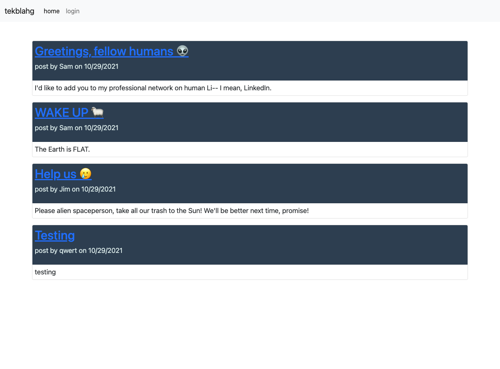
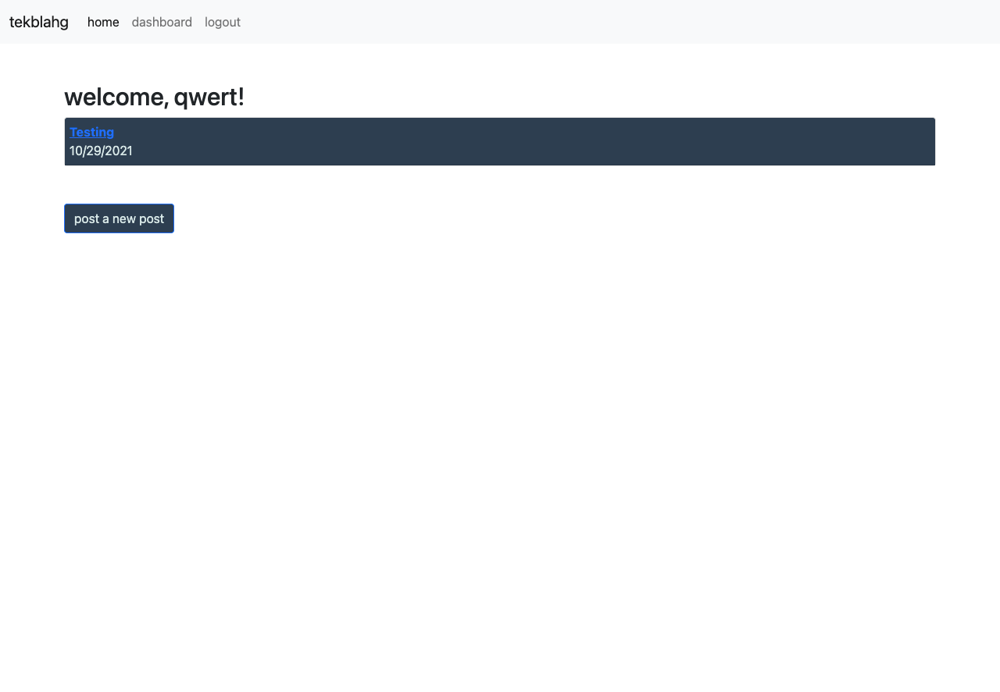
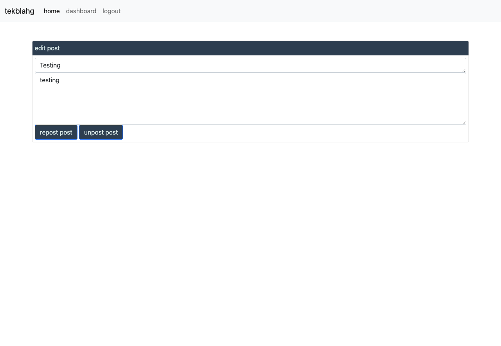

# tekblahg 
A community blog site, rendered with Handlebars.js.
## Table of Contents
1. [Usage](#usage)
2. [Questions](#questions)
## Usage
- Navigate to [tekblahg](https://tekblahg.herokuapp.com) - Log in or create new user - Use navbar links to select page - Home page shows all community blog posts - Click on a post to view or add comments - Dashboard allows user to view their posts, and post new posts. - Select a post from the dashboard to open the post update page - From here, users can update or delete their selected post

## Questions
Additional questions? Please contact me at sammn721@gmail.com.
For more projects, please visit my [GitHub profile](https://github.com/sammn721).
